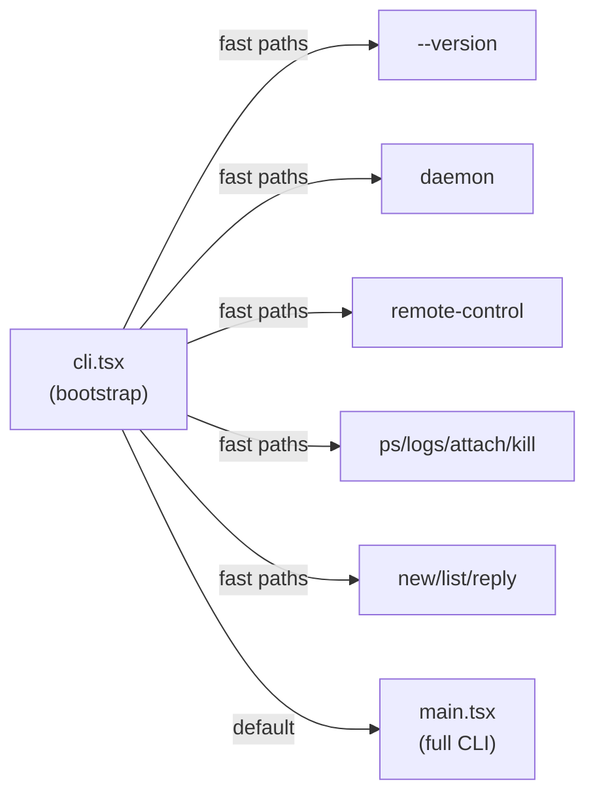
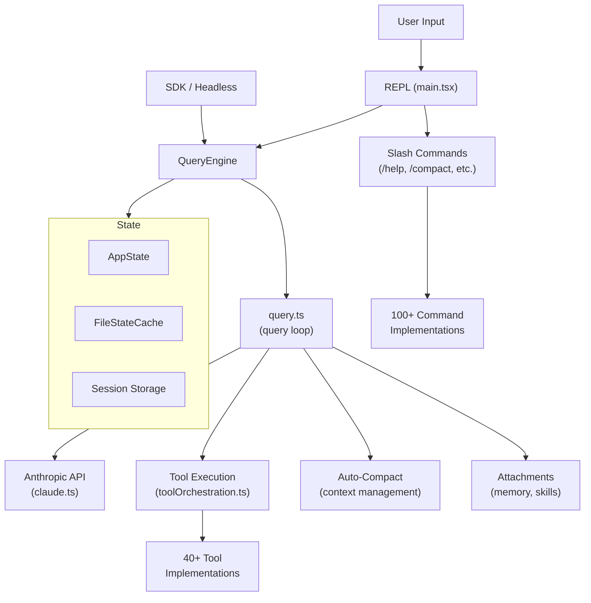
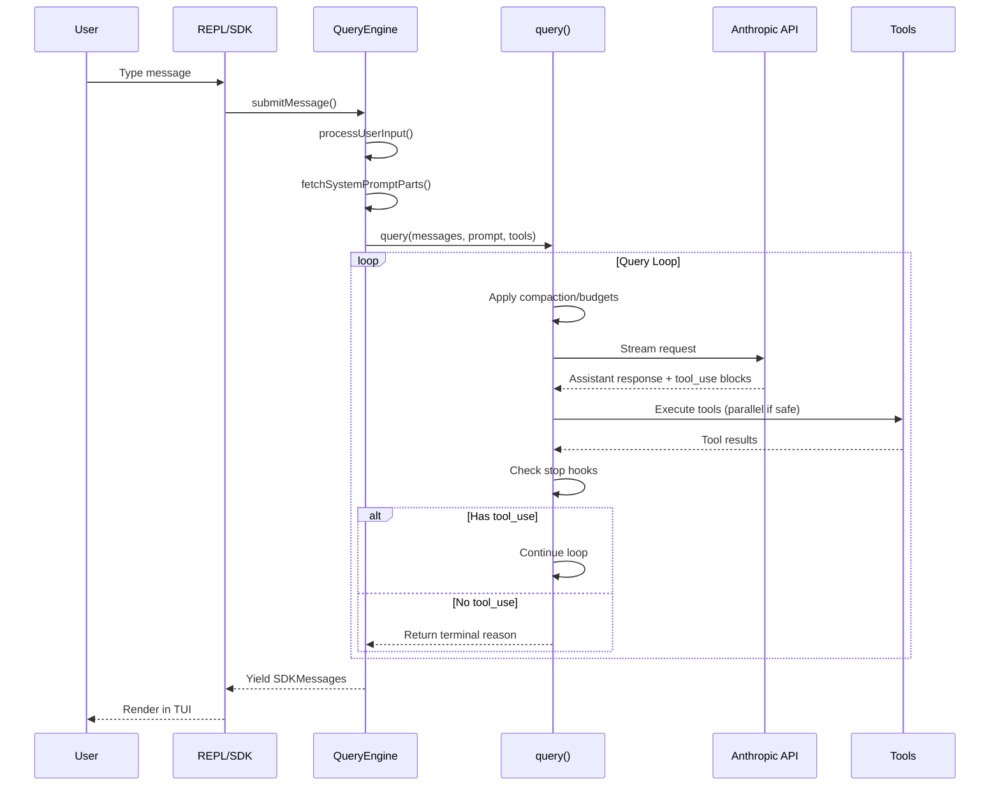

# Claude Code — Codebase Walkthrough

## Overview

This is the source code for **Claude Code**, an AI-powered terminal coding assistant. It's a **TypeScript** application built on:

- **Bun** as the JS runtime and bundler
- **React + Ink** for the terminal UI (TUI)
- **Anthropic API** for LLM interactions
- **MCP (Model Context Protocol)** for extensible tool connections

The codebase is large (~800KB+ `main.tsx`, 40+ tools, 80+ commands, 290+ utils) and follows a layered architecture with clear separation between the CLI shell, query engine, tool system, and UI.

---

## 1. Entrypoints



### [cli.tsx](file:///Users/avishukla/Desktop/src/entrypoints/cli.tsx) — Bootstrap Entrypoint
The very first thing that runs. Handles **fast paths** that don't need the full CLI loaded:
- `--version` / `-v` — prints version, zero imports
- `--dump-system-prompt` — outputs rendered system prompt (ant-only)
- `--daemon-worker` — spawns a lean daemon worker
- `remote-control` / `bridge` — bridge mode for remote environments
- `daemon` — long-running supervisor process
- `ps` / `logs` / `attach` / `kill` — background session management
- `new` / `list` / `reply` — template job commands
- `--worktree --tmux` — exec into tmux worktree

If no fast path matches → loads `main.tsx` (the full CLI).

### [init.ts](file:///Users/avishukla/Desktop/src/entrypoints/init.ts) — Initialization
Called once at startup. Sets up:
- Configuration validation and loading (`enableConfigs()`)
- Safe environment variable application
- Graceful shutdown handlers
- 1P event logging and analytics (GrowthBook)
- OAuth population, JetBrains detection, git repo detection
- Remote managed settings and policy limits
- mTLS, proxy configuration, API preconnect
- Telemetry initialization (deferred until trust is granted)

### [main.tsx](file:///Users/avishukla/Desktop/src/main.tsx) — Full CLI
The 800KB+ main module. Sets up Commander.js CLI argument parsing, wires up the REPL, and renders the Ink-based TUI. This is the heaviest module and is why the fast paths in `cli.tsx` exist — to avoid loading it for simple operations.

---

## 2. Core Architecture



### Two Modes of Operation

| Mode | Entry | How it works |
|------|-------|-------------|
| **Interactive (REPL)** | `main.tsx` → Ink TUI | Full terminal UI with keybindings, scrolling, vim mode, themes |
| **Headless (SDK/Print)** | `QueryEngine` | Programmatic API, streams `SDKMessage` events, used by extensions and CI |

---

## 3. Query Engine & Loop

### [QueryEngine.ts](file:///Users/avishukla/Desktop/src/QueryEngine.ts) — Session Orchestrator
One `QueryEngine` per conversation. Owns:
- Message history (`mutableMessages`)
- File state cache
- Abort controller
- Usage tracking
- Permission denial tracking

Key method: `submitMessage()` — an async generator that:
1. Processes user input (slash commands, attachments)
2. Builds system prompt parts
3. Calls `query()` loop
4. Yields `SDKMessage` events (assistant text, tool results, errors, etc.)
5. Records transcript to session storage

### [query.ts](file:///Users/avishukla/Desktop/src/query.ts) — The Query Loop
The heart of the system. An infinite loop that:

```
while (true) {
  1. Apply tool result budget
  2. Run snip compaction (if enabled)
  3. Run microcompact (collapse old tool results)
  4. Run context collapse (if enabled)
  5. Run auto-compact (summarize if context too large)
  6. Check blocking token limits
  7. Stream from Anthropic API
  8. Execute tool calls (parallel when safe)
  9. Handle stop hooks
  10. Continue if tool_use, else return
}
```

Mutable state carried across iterations:
- `messages` — conversation history
- `toolUseContext` — current context for tool execution
- `autoCompactTracking` — compaction state
- `maxOutputTokensRecoveryCount` — for truncation recovery
- `turnCount` — iteration counter

---

## 4. Tool System

### [Tool.ts](file:///Users/avishukla/Desktop/src/Tool.ts) — Tool Interface

Every tool implements the `Tool` type (built via `buildTool()`):

| Method | Purpose |
|--------|---------|
| `call()` | Execute the tool |
| `prompt()` | Generate tool description for system prompt |
| `checkPermissions()` | Tool-specific permission logic |
| `validateInput()` | Input validation before execution |
| `isReadOnly()` | Whether tool modifies state |
| `isConcurrencySafe()` | Whether tool can run in parallel |
| `isDestructive()` | Irreversible operations flag |
| `renderToolUseMessage()` | React component for TUI display |
| `renderToolResultMessage()` | React component for result display |
| `mapToolResultToToolResultBlockParam()` | Convert result to API format |
| `preparePermissionMatcher()` | Hook pattern matching |
| `userFacingName()` | Display name in UI |

### Tool Inventory (40+ tools in `tools/`)

```
├── AgentTool/          # Spawn subagents (workers)
├── BashTool/           # Shell command execution
├── FileEditTool/       # Edit files with search/replace
├── FileReadTool/       # Read file contents
├── FileWriteTool/      # Write new files
├── GlobTool/           # Find files by pattern
├── GrepTool/           # Search file contents (ripgrep)
├── LSPTool/            # Language Server Protocol integration
├── MCPTool/            # Model Context Protocol tool calls
├── NotebookEditTool/   # Jupyter notebook editing
├── REPLTool/           # Interactive REPL execution
├── WebFetchTool/       # Fetch web content
├── WebSearchTool/      # Web search
├── TaskCreateTool/     # Background task creation
├── TaskGetTool/        # Query task status
├── TaskStopTool/       # Stop running tasks
├── TeamCreateTool/     # Create agent teams (swarms)
├── TeamDeleteTool/     # Delete agent teams
├── SendMessageTool/    # Send messages to agents
├── SkillTool/          # Invoke registered skills
├── ToolSearchTool/     # Search for deferred tools
├── SleepTool/          # Wait/pause execution
├── TodoWriteTool/      # Manage todo lists
├── ConfigTool/         # Read/write configuration
├── AskUserQuestionTool/# Ask user for input
├── EnterPlanModeTool/  # Switch to plan mode
├── ExitPlanModeTool/   # Exit plan mode
├── EnterWorktreeTool/  # Enter git worktree
├── ExitWorktreeTool/   # Exit git worktree
├── BriefTool/          # Summarize conversation
├── PowerShellTool/     # PowerShell execution (Windows)
├── RemoteTriggerTool/  # Trigger remote actions
├── ScheduleCronTool/   # Schedule cron jobs
├── SyntheticOutputTool/# Structured output enforcement
├── shared/             # Shared tool utilities
└── testing/            # Test helpers
```

### [tools.ts](file:///Users/avishukla/Desktop/src/tools.ts) — Tool Assembly
Assembles all tools into the final list. Filters by:
- Feature flags (`feature()` from `bun:bundle`)
- Environment (`CLAUDE_CODE_SIMPLE` disables many tools)
- Platform (PowerShell on Windows only)

### `ToolUseContext` — Runtime Context
Every tool call receives a `ToolUseContext` with:
- Current messages, app state, options
- Abort controller
- File state cache
- Progress callbacks
- Permission context
- Agent ID (for subagents)
- Notification system
- File history tracking

---

## 5. Command System

### [commands.ts](file:///Users/avishukla/Desktop/src/commands.ts) — Command Registry

Commands are slash commands (`/help`, `/compact`, `/model`, etc.). Three types:

| Type | Behavior |
|------|----------|
| `local` | Execute locally, return text output |
| `local-jsx` | Execute locally, render React/Ink UI |
| `prompt` | Expand to text sent to the model |

### Command Inventory (100+ commands in `commands/`)

Key built-in commands:
- `/help`, `/clear`, `/exit` — basics
- `/compact` — manually compact context
- `/model` — switch model
- `/config` — view/edit configuration
- `/memory` — manage CLAUDE.md files
- `/mcp` — manage MCP servers
- `/permissions` — permission management
- `/plan` — toggle plan mode
- `/diff` — show file changes
- `/commit` — git commit
- `/review` — code review
- `/resume` — resume previous session
- `/theme` — change terminal theme
- `/vim` — toggle vim mode
- `/skills` — manage skills
- `/plugin` — manage plugins
- `/agents` — agent management
- `/tasks` — background task management
- `/rewind` — undo changes
- `/export` — export conversation
- `/stats` — session statistics
- `/teleport` — teleport sessions across machines

Commands are loaded from multiple sources:
1. **Built-in** — hardcoded in `commands/`
2. **Skills** — from `.claude/skills/` directories
3. **Plugins** — from installed plugins
4. **Bundled** — bundled skill definitions
5. **MCP** — from MCP server prompts
6. **Workflows** — from workflow scripts

---

## 6. Coordinator Mode

### [coordinatorMode.ts](file:///Users/avishukla/Desktop/src/coordinator/coordinatorMode.ts)

When `CLAUDE_CODE_COORDINATOR_MODE=1`, Claude operates as a **coordinator** that:
- Doesn't execute tools directly
- Spawns **workers** via `AgentTool`
- Continues workers via `SendMessageTool`
- Stops workers via `TaskStopTool`
- Synthesizes worker results for the user

The coordinator prompt defines a structured workflow:
1. **Research** — parallel workers investigate
2. **Synthesis** — coordinator reads findings, crafts specs
3. **Implementation** — workers make targeted changes
4. **Verification** — workers test changes

Key design: **Workers can't see the coordinator's conversation**. Every prompt must be self-contained.

---

## 7. Context Management

### [context.ts](file:///Users/avishukla/Desktop/src/context.ts) — Context Assembly

Two types of context prepended to every conversation:

| Context | Source | Contents |
|---------|--------|----------|
| **User Context** | `getUserContext()` | CLAUDE.md files, current date |
| **System Context** | `getSystemContext()` | Git status (branch, recent commits, file status) |

### Auto-Compact (`services/compact/`)
When context gets too large:
1. **Snip compaction** — removes old messages beyond a threshold
2. **Microcompact** — collapses old tool results into summaries
3. **Auto-compact** — full summarization via side API call
4. **Reactive compact** — triggers on `prompt_too_long` errors
5. **Context collapse** — staged collapse of message groups

### Attachments (`utils/attachments.ts`)
Before each query, relevant context is attached:
- **Memory files** — CLAUDE.md, nested memory files
- **Skill discovery** — relevant skills prefetched
- **Dynamic skills** — discovered during file operations

---

## 8. Services Layer

### `services/` Directory

| Service | Purpose |
|---------|---------|
| `api/` | Anthropic API client, retry logic, error handling |
| `analytics/` | Event logging, GrowthBook feature flags |
| `compact/` | Context compaction (auto, micro, snip, reactive) |
| `lsp/` | Language Server Protocol integration |
| `mcp/` | Model Context Protocol server management |
| `oauth/` | OAuth authentication flow |
| `plugins/` | Plugin loading and management |
| `policyLimits/` | Organization policy enforcement |
| `remoteManagedSettings/` | Remote settings sync |
| `settingsSync/` | Settings synchronization |
| `teamMemorySync/` | Team memory synchronization |
| `tips/` | Usage tips system |
| `tools/` | Tool orchestration (`StreamingToolExecutor`) |
| `toolUseSummary/` | Tool use summary generation |
| `voice.ts` | Voice input/output |
| `vcr.ts` | Session recording/replay |

### MCP Integration (`services/mcp/`)
Supports connecting to external MCP servers that provide:
- Additional tools
- Resources (files, data)
- Prompts (skills)

---

## 9. State Management

### [AppState.tsx](file:///Users/avishukla/Desktop/src/state/AppState.tsx) — Application State

Central state store containing:
- `messages` — conversation history
- `toolPermissionContext` — permission rules and mode
- `mcp` — MCP server connections, tools, resources
- `fastMode` — fast mode state
- `effortValue` — reasoning effort level
- `fileHistory` — file change tracking
- `attribution` — commit attribution
- And many more UI/session state fields

### [AppStateStore.ts](file:///Users/avishukla/Desktop/src/state/AppStateStore.ts)
Zustand-like store with `getAppState()` / `setAppState()` pattern. The store is the single source of truth — tools read from it, user actions write to it.

---

## 10. UI Layer (Components)

### Component Hierarchy

```
App.tsx
├── FullscreenLayout.tsx          # Main layout with scrolling
│   ├── Messages.tsx              # Message list renderer
│   │   ├── Message.tsx           # Individual message
│   │   ├── MessageRow.tsx        # Message row with metadata
│   │   └── VirtualMessageList.tsx # Virtualized scrolling
│   ├── PromptInput/              # User input area
│   ├── StatusLine.tsx            # Bottom status bar
│   └── Spinner.tsx               # Activity spinner
├── ModelPicker.tsx               # Model selection dialog
├── ThemePicker.tsx               # Theme selection
├── GlobalSearchDialog.tsx        # Search across messages
├── HistorySearchDialog.tsx       # Search command history
├── Settings/                     # Settings panels
└── ... (100+ more components)
```

### Key UI Features
- **Virtual scrolling** — efficient rendering of long conversations
- **Vim mode** — full vim keybindings support
- **Themes** — multiple color themes
- **Diff rendering** — structured diff display for file edits
- **Markdown rendering** — rich markdown in terminal
- **Syntax highlighting** — code blocks with highlighting
- **Image display** — terminal image rendering
- **Voice integration** — speech-to-text input

---

## 11. Hooks System

### `hooks/` — React Hooks (80+ hooks)

Key interactive hooks:
- `useCanUseTool` — permission checking for tool execution
- `useTypeahead` — slash command autocomplete
- `useVirtualScroll` — efficient message scrolling
- `useVoiceIntegration` — voice input handling
- `useReplBridge` — bridge mode communication
- `useGlobalKeybindings` — keyboard shortcut handling
- `useArrowKeyHistory` — input history navigation
- `usePasteHandler` — clipboard paste handling
- `useTextInput` — text input management

### Tool Permission Hooks (`hooks/toolPermission/`)
Complex permission system with:
- **Permission modes**: `default`, `plan`, `bypassPermissions`, `auto`
- **Permission rules**: `alwaysAllow`, `alwaysDeny`, `alwaysAsk` (per tool/pattern)
- **Sources**: project CLAUDE.md, user settings, enterprise policy
- **Auto-mode classifier** — ML-based approval for safe operations

### User Hooks (`utils/hooks.ts` — 160KB!)
Server-side hooks system for custom automation:
- `PreToolUse` — runs before tool execution
- `PostToolUse` — runs after tool execution  
- `Notification` — custom notifications
- `Stop` — custom stop conditions

---

## 12. Key Subsystems

### Permissions (`utils/permissions/`)
Multi-layered permission system:
1. Tool validates input (`validateInput`)
2. Tool checks permissions (`checkPermissions`)
3. Hook system runs `PreToolUse` hooks
4. Auto-mode classifier evaluates (if in auto mode)
5. User prompted if needed
6. `PostToolUse` hooks run after execution

### Session Storage (`utils/sessionStorage.ts` — 180KB)
Persistent session management:
- Transcript recording (JSONL format)
- Session resume from disk
- Cross-machine teleport
- Background session management

### Skills (`skills/`)
Reusable prompt templates that extend capabilities:
- Loaded from `.claude/skills/` directories
- Can be bundled or from plugins
- Invoked via `SkillTool` or slash commands
- Support frontmatter metadata (description, when to use)

### Plugins (`plugins/`)
Extension system:
- Custom tools, commands, and skills
- MCP server integration
- Built-in plugins (LSP, etc.)
- Plugin marketplace (`plugin marketplace list`)

---

## 13. Configuration

### Config Sources (in priority order)
1. **Enterprise policy** — remote managed settings
2. **User global** — `~/.claude/settings.json`
3. **Project** — `.claude/settings.json`
4. **CLAUDE.md files** — project/user/enterprise memory
5. **Environment variables** — `CLAUDE_CODE_*`

### Key Environment Variables
| Variable | Purpose |
|----------|---------|
| `CLAUDE_CODE_REMOTE` | Running in remote/container mode |
| `CLAUDE_CODE_COORDINATOR_MODE` | Enable coordinator mode |
| `CLAUDE_CODE_SIMPLE` | Minimal tool set |
| `CLAUDE_CODE_DISABLE_THINKING` | Disable thinking blocks |
| `DISABLE_AUTO_COMPACT` | Disable automatic compaction |

---

## 14. Build System

The project uses **Bun** for both runtime and bundling:
- `feature()` from `bun:bundle` — build-time feature flags for dead code elimination
- `MACRO.VERSION` — build-time version injection
- Conditional `require()` — lazy loading behind feature gates
- Source maps embedded as base64

Feature flags gate entire subsystems:
`BRIDGE_MODE`, `DAEMON`, `BG_SESSIONS`, `TEMPLATES`, `COORDINATOR_MODE`, `VOICE_MODE`, `HISTORY_SNIP`, `REACTIVE_COMPACT`, `CONTEXT_COLLAPSE`, `EXPERIMENTAL_SKILL_SEARCH`, `MCP_SKILLS`, `ULTRAPLAN`, `FORK_SUBAGENT`, etc.

---

## 15. Data Flow Summary



---

## 16. File Size Hotspots

| File | Size | Why |
|------|------|-----|
| `main.tsx` | 800KB | Full CLI setup, Commander.js, REPL wiring |
| `cli/print.ts` | 212KB | Print/headless mode handler |
| `utils/ansiToPng.ts` | 215KB | ANSI screenshot rendering |
| `utils/messages.ts` | 193KB | Message creation, normalization, filtering |
| `utils/sessionStorage.ts` | 180KB | Session persistence (JSONL, resume, etc.) |
| `utils/hooks.ts` | 159KB | User hooks system (Pre/PostToolUse) |
| `components/Messages.tsx` | 147KB | Message list rendering |
| `components/VirtualMessageList.tsx` | 148KB | Virtualized scrolling |
| `utils/attachments.ts` | 127KB | Memory/skill attachment logic |
| `commands/insights.ts` | 115KB | Usage analytics report |

> [!TIP]
> Many of these large files are candidates for further decomposition — the codebase is actively being refactored (e.g., `Tool.ts` → `types/tools.ts`, `commands.ts` → `types/command.ts`).
